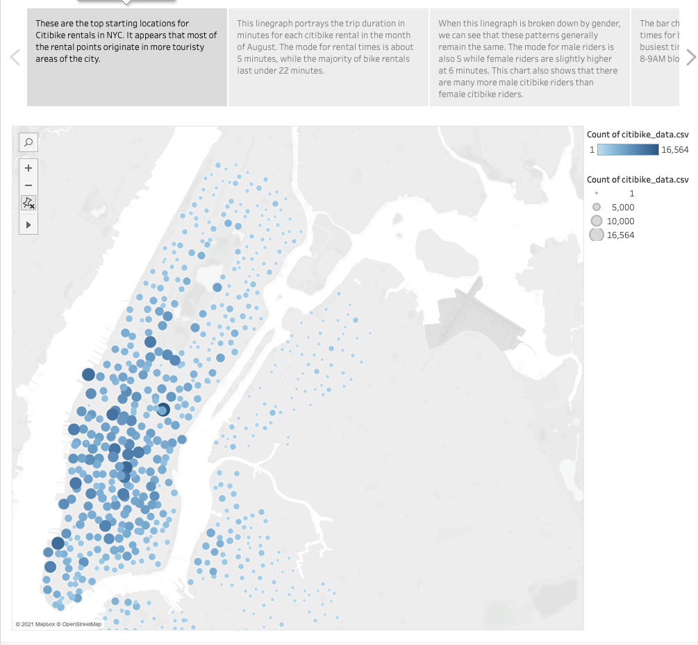

# bikesharing

Click here to view the story on Tableau Public: [NYC Citibike Analysis](https://public.tableau.com/app/profile/ryan.lerner/viz/Tableau_Challenge_16222037199940/Story1)

## Overview of Analysis
This analysis is intended to visualize bike-sharing data from New York City in order to predict whether a similar model might be successful in Des Moines, Iowa. Based on the dataset, we plotted linegraphs, bar charts, and heatmaps to view average biking duration and trends between gender and peak biking hours. 

## Results
The visualizations based on the biking data are shown below:

## Summary
Based on these charts, we can conclude that a vast majority of people in NYC using Citibikes are doing so for commuting purposes, given that peak hours occur when "9 to 5" jobs typically begin and end on weekdays. When separating these charts by gender, we can also see that a majority of these riders happen to be male. Additionally, many bike trips tend to be around 5-20 minutes long, which means that bike stations in Des Moines would need to be relatively close together to account for these shorter trip durations. '

We can add some additional visualizations that further investigate the differences between user-types. While it appears that the majority of starting points on our Manhattan map originate in touristy areas, these are also areas that contain many places of business. I would be interested in separate "Top Starting Locations" maps by user-type since subscribers are more likely to be commuters than one-time customers are. We could also replicate the "Checkout Times" linegraph to separate by user-type. I think it's likely that we would see more useful discrepancies in this chart between customers and subscribers than we would with male and female riders. The separation by gender is nice for viewing, but does not practically help us in recognizing patterns between commuters and tourists. 
